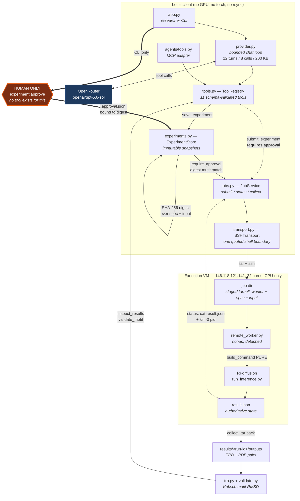
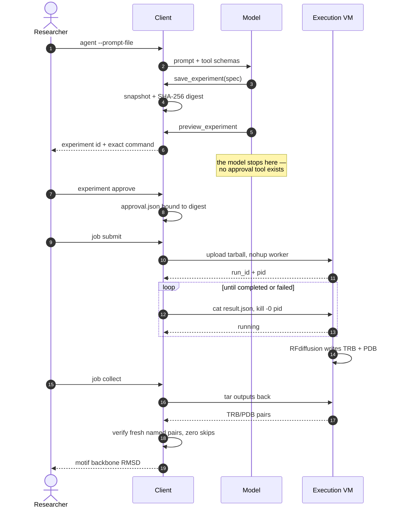

# Architecture

The endpoint-driven path, as exercised end to end on 2026-09-16.

## What the shape enforces

| Property | Mechanism |
|---|---|
| The model cannot self-approve | `approve()` is reachable only from `app.py` argparse; no tool schema exposes it |
| Approval cannot be transplanted | `approval.json` stores the SHA-256 over `{spec, input_sha256}`; `require_approval` re-checks it |
| The model cannot flood the VM | `ToolRegistry` counts against `max_agent_submissions: 1` |
| Execution target is swappable | `build_command()` is pure; the worker passes explicit `cfg` and POSIX paths |
| Ambiguity is never success | SSH exit 255 maps to `unknown`, not `failed`; `collect` demands fresh named TRB/PDB pairs and zero skips |

## Sequence

